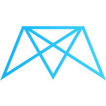

<a name="readme-top"></a>

[![Issues][issues-shield]][issues-url]
[![MIT License][license-shield]][license-url]
[![LinkedIn][linkedin-shield]][linkedin-url]

<!-- PROJECT LOGO -->
<br />
<div align="center">
  <a href="https://github.com/webdevtut/detour">
    
  </a>

  <h3 align="center">Détour</h3>

  <p align="center">
    Tourism & Travel Guide Website
    <br />
    <a href="https://github.com/webdevtut/detour/blob/master/README.md"><strong>Explore the docs »</strong></a>
    <br />
    <br />
    <a href="https://d-tour.up.railway.app/responsive">View Demo</a>
    ·
    <a href="https://github.com/webdevtut/detour/issues">Report Bug</a>
    ·
    <a href="https://github.com/webdevtut/detour/issues">Request Feature</a>
  </p>
</div>

<!-- TABLE OF CONTENTS -->
<details>
  <summary>Table of Contents</summary>
  <ol>
    <li>
      <a href="#about-the-project">About The Project</a>
      <ul>
        <li><a href="#built-with">Built With</a></li>
      </ul>
    </li>
    <li>
      <a href="#getting-started">Getting Started</a>
      <ul>
        <li><a href="#prerequisites">Prerequisites</a></li>
        <li><a href="#installation">Installation</a></li>
      </ul>
    </li>
    <li><a href="#usage">Usage</a></li>
    <li><a href="#roadmap">Roadmap</a></li>
    <li><a href="#contributing">Contributing</a></li>
    <li><a href="#license">License</a></li>
    <li><a href="#contact">Contact</a></li>
    <li><a href="#acknowledgments">Acknowledgments</a></li>
  </ol>
</details>

<!-- ABOUT THE PROJECT -->

## About The Project

[![Détour Screen Shot][product-screenshot]](https://d-tour.up.railway.app/responsive)

Basic Tours and Travel Guide Web application created from scratch for self-learning and showcase purpose.

Features :

- 3D Interactive Globe for location 🌏

[![Détour Globe Feature][product-globe-gif]](https://d-tour.up.railway.app/nearby-tours)

- Payment Integration with Stripe

[![Détour Globe Feature][product-payment]](https://d-tour.up.railway.app/tour/the-sea-explorer1)

- Foolproof authentication with JWT and cookies 🍪
- Responsive for multiple screens :smile:

<p align="right">(<a href="#readme-top">back to top</a>)</p>

### Built With

Following Frameworks are used to make this project

- [![HTML][HTML.io]][HTML-url]
- [![Node][Node.io]][Node-url]
- [![EXPRESS][EXPRESS.io]][EXPRESS-url]
- [![MONGODB][MONGODB.io]][MONGODB-url]
- [![CSS][CSS.io]][CSS-url]
- [![SASS][SASS.io]][SASS-url]

<p align="right">(<a href="#readme-top">back to top</a>)</p>

<!-- GETTING STARTED -->

## Getting Started

To get a local copy up and running follow these steps.

### Prerequisites

Install Node v14+

- npm
  ```sh
  npm install npm@latest -g
  ```

### Installation

1. Install NPM packages
   ```sh
   npm install
   ```
2. Install live-server package globally
   ```sh
   npm i live-server -g
   ```
3. Run below command in cloned project directory
   ```sh
   npm run start:dev
   ```

<p align="right">(<a href="#readme-top">back to top</a>)</p>

<!-- USAGE EXAMPLES -->

## Usage

Create an account on deployed website to see the example🤗.

_For more examples, please refer to the [Documentation](https://d-tour.up.railway.app/signup)_

<p align="right">(<a href="#readme-top">back to top</a>)</p>

<!-- ROADMAP -->

## Roadmap

- [x] Create Pure CSS Popup
- [x] Sign-up & Login Functionality
- [x] Interactive 3D Globe 🌏 Map Integration
- [x] Use SASS Mixins to create Responsive Template
- [x] Use Pug Templates, Express JS, NodeJS, MongoDB to Create Dynamic website.👩‍💻
- [ ] Add Features for User Accessibility
  - [ ] Camera access on device for taking pictures and uploading straight from device

See the [open issues](https://github.com/webdevtut/detour/issues) for a full list of proposed features (and known issues).

<p align="right">(<a href="#readme-top">back to top</a>)</p>

<!-- CONTRIBUTING -->

## Contributing

Contributions are what make the open source community such an amazing place to learn, inspire, and create. Any contributions you make are **greatly appreciated**.

If you have a suggestion that would make this better, please fork the repo and create a pull request. You can also simply open an issue with the tag "enhancement".
Don't forget to give the project a star! Thanks again!

1. Fork the Project
2. Create your Feature Branch (`git checkout -b feature/AmazingFeature`)
3. Commit your Changes (`git commit -m 'Add some AmazingFeature'`)
4. Push to the Branch (`git push origin feature/AmazingFeature`)
5. Open a Pull Request

<p align="right">(<a href="#readme-top">back to top</a>)</p>

<!-- LICENSE -->

## License

Distributed under the MIT License. See `LICENSE.txt` for more information.

<p align="right">(<a href="#readme-top">back to top</a>)</p>

<!-- CONTACT -->

## Contact

Your Name - [@tushar-web-dev](https://linkedin.com/in/tushar-web-dev/) - tusharlookingforjob@gmail.com

Project Link : [https://d-tour.up.railway.app](https://d-tour.up.railway.app/signup)

Repository for NodeJS APIs is not public contact me for collaboration. [Udemy Certificate for NodeJS Course](https://www.udemy.com/certificate/UC-fb01642f-08ea-4305-851e-e37ebd37c528/)

<p align="right">(<a href="#readme-top">back to top</a>)</p>

<!-- ACKNOWLEDGMENTS -->

## Acknowledgments

Links I've found useful while building this project

- [Mapbox](https://www.mapbox.com/)
- [Pug HTML Templates](https://pugjs.org/)
- [Alternative to Heroku for deployment](https://railway.app/)
- [Choose an Open Source License](https://choosealicense.com)
- [GitHub Emoji Cheat Sheet](https://www.webpagefx.com/tools/emoji-cheat-sheet)
- [Img Shields](https://shields.io)
- [GitHub Pages](https://pages.github.com)
- [Font Awesome](https://fontawesome.com)

<p align="right">(<a href="#readme-top">back to top</a>)</p>

<!-- MARKDOWN LINKS & IMAGES -->

[issues-shield]: https://img.shields.io/github/issues/webdevtut/detour.svg?style=for-the-badge
[issues-url]: https://github.com/webdevtut/detour/issues
[license-shield]: https://img.shields.io/github/license/webdevtut/detour.svg?style=for-the-badge
[license-url]: https://github.com/webdevtut/detour/blob/master/LICENSE.txt
[linkedin-shield]: https://img.shields.io/badge/-LinkedIn-black.svg?style=for-the-badge&logo=linkedin&colorB=555
[linkedin-url]: https://linkedin.com/in/tushar-web-dev/
[product-screenshot]: deployed-images/screenshot.png
[product-globe-gif]: deployed-images/globe.gif
[product-payment]: deployed-images/payment-feature.png
[HTML.io]: https://img.shields.io/badge/HTML-E34F26?style=for-the-badge&logo=html5&logoColor=white
[HTML-url]: https://dev.w3.org/html5/spec-LC/
[CSS.io]: https://img.shields.io/badge/CSS-1572B6?style=for-the-badge&logo=css3&logoColor=white
[CSS-url]: https://www.w3.org/Style/CSS/Overview.en.html
[SASS.io]: https://img.shields.io/badge/SASS-CC6699?style=for-the-badge&logo=sass&logoColor=white
[SASS-url]: https://sass-lang.com/
[Node.io]: https://img.shields.io/badge/Node.js-339933?style=for-the-badge&logo=nodedotjs&logoColor=white
[Node-url]: https://nodejs.org/
[MONGODB.io]: https://img.shields.io/badge/MONGODB-47A248?style=for-the-badge&logo=mongodb&logoColor=white
[MONGODB-url]: https://www.mongodb.com/
[EXPRESS.io]: https://img.shields.io/badge/EXPRESSJS-000000?style=for-the-badge&logo=express&logoColor=white
[EXPRESS-url]: https://expressjs.com/
